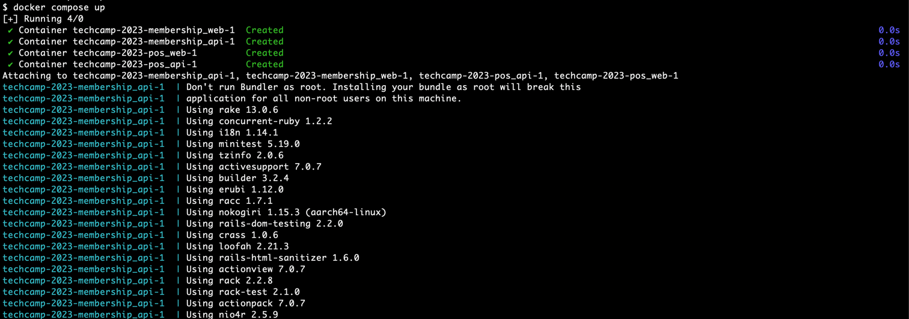

# Getting Started
STORES Tech camp 2023で開発するサービスの参照実装について紹介していきます。

## techcamp-2023リポジトリ
STORES Tech camp で提供するコードは <https://github.com/heyinc/techcamp-2023> に集約されています。

### リポジトリのフォーク、Pull Request の作成
まず <https://github.com/heyinc/techcamp-2023> のリポジトリをチームメンバーいずれかのユーザ、もしくはオーガニゼーションにフォークしてからクローンしてください。

STORES Tech campで実装したコードはフォークした先のtechcamp-2023リポジトリにコミットしてください。

## 参照実装の起動
参照実装はDocker Compose、またはローカル環境で起動することができます。

リポジトリのREADMEに従って実行すると、以下の2つの参照実装が起動します。

- POS http://localhost:8001/
- Membership http://localhost:8002/

