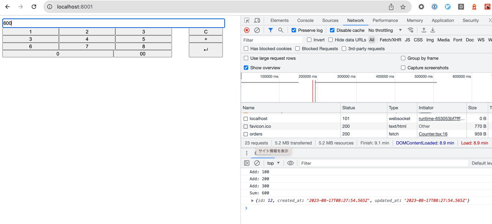

# POS
レジアプリケーションとしての参照実装です。

## 機能

- 商品金額登録
  - 数字ボタンもしくは入力欄から金額を入力し、+ボタンもしくは+キーで商品金額を登録します
- 商品金額合計表示
  - 商品金額登録が完了したら↵ボタンもしくはエンターキー入力で商品金額合計を表示します
  - 合計表示時、APIにて注文内容を登録します
- 入力のクリア
  - 入力中の商品金額情報をクリアします

記録された商品情報の閲覧などの機能は実装されていません。
